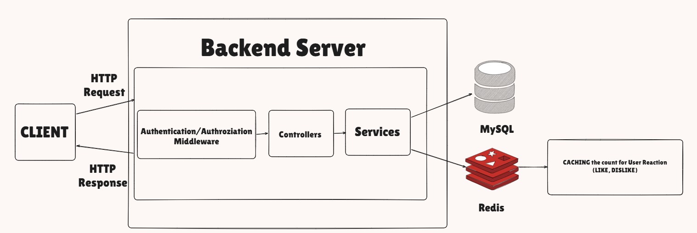
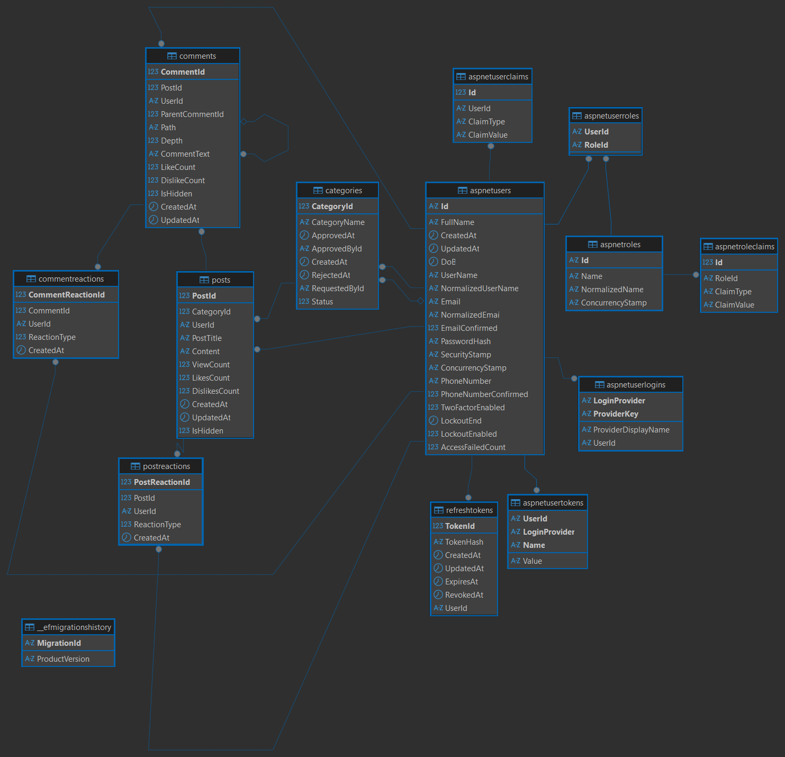

# Community Platform Backend

> This project focuses on the real-world community platform Backend Serv

> It includes JWT-based authentication, refresh token rotation, hashed token persistence, role-based authorization, and a scalable domain structure for community features.

## Tech Stack

| Area                        | Technology                                          |
| --------------------------- |-----------------------------------------------------|
| Backend                     | ASP.NET Core Web API (**.NET 9**)                     |
| Language                    | C#                                                  |
| Database                    | MySQL                                               |
| Token Strategy              | Access Token + Refresh Token Rotation               |
| API Documentation           | OpenAPI / Scalar                                    |
| Containerization            | Docker, Docker Compose                              |
| Cache / Future Optimization | Redis                                               |

---

## Functional Requirements

### Authentication & Authorization

* User registration using ASP.NET Core Identity
* User sign-in with JWT access token
* Refresh token rotation using HttpOnly cookies
* Secure refresh token storage using SHA-256 hash
* Logout with refresh token revocation
* Role-based authorization
* Admin role seeding

### Category Management

* Authenticated users can request new categories
* Public category listing
* Public category detail retrieval
* Admin or CategoryManager can approve category requests
* Admin or CategoryManager can reject category requests
* Admin or CategoryManager can delete categories

### Planned Features

* Post creation, listing, detail retrieval, update, and delete
* Comment and nested reply system
* Post and comment reactions
* View count system
* Redis-based popular post caching
* API validation and standardized error responses

---

## System Diagram



---

## DB Schemas



>**TOOL** : `DBeaver`
---

## API Endpoints

### Auth API

| Method | Endpoint             | Auth Required | Description                                       |
| ------ | -------------------- | ------------- | ------------------------------------------------- |
| POST   | `/api/auth/register` | No            | Register new user                                 |
| POST   | `/api/auth/signin`   | No            | Sign in and receive access token                  |
| POST   | `/api/auth/refresh`  | No            | Rotate refresh token and receive new access token |
| POST   | `/api/auth/logout`   | No            | Revoke refresh token and clear cookie             |
| GET    | `/api/auth/me`       | Yes           | Get current authenticated user info               |

### Category API

| Method | Endpoint                               | Auth Required | Role                   | Description            |
| ------ | -------------------------------------- | ------------- | ---------------------- | ---------------------- |
| POST   | `/api/categories/request`              | Yes           | User                   | Request a new category |
| GET    | `/api/categories`                      | No            | Public                 | Get all categories     |
| GET    | `/api/categories/{categoryId}`         | No            | Public                 | Get category by ID     |
| POST   | `/api/categories/{categoryId}/approve` | Yes           | Admin, CategoryManager | Approve category       |
| POST   | `/api/categories/{categoryId}/reject`  | Yes           | Admin, CategoryManager | Reject category        |
| DELETE | `/api/categories/{categoryId}`         | Yes           | Admin, CategoryManager | Delete category        |

---

## Security Design

* JWT access tokens are used for authenticated API requests.
* Refresh tokens are stored in HttpOnly cookies.
* Raw refresh tokens are never stored in the database.
* Only SHA-256 hashed refresh tokens are persisted.
* Refresh token rotation is applied when issuing a new access token.
* Old refresh tokens are revoked after rotation.
* Role-based authorization is used for protected management endpoints.

---

## Getting Started

### Run Docker Containers

```bash
docker compose up -d --build
```

### Apply EF Core Migrations

```bash
dotnet ef database update
```

### Run API Locally

```bash
dotnet run
```

---

## Environment Variables

The application uses environment variables for production-like execution through Docker Compose.

Example:

```env
DB_ROOT_PASSWORD=your-database-password
PROD_JWT_SECRET=your-production-jwt-secret
```

For local development, `appsettings.json` or `appsettings.Development.json` can be used with a local JWT secret.


